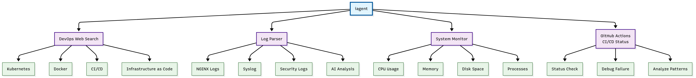

# iagent - DevOps AI Agent

**iagent** is an intelligent AI agent framework specifically optimized for DevOps tasks. It combines the power of Large Language Models (LLMs) with practical DevOps tools to help you troubleshoot, debug, and solve infrastructure problems.

## Architecture



## Features

- **DevOps-Focused**: Specialized for web search, log analysis, system monitoring, and CI/CD debugging
- **Multi-LLM Support**: Works with OpenAI, LiteLLM, Ollama, HuggingFace, and AWS Bedrock
- **Safe by Default**: Code preview mode prevents accidental execution
- **AI-Powered Search**: Real-time DevOps troubleshooting with direct answers
- **Intelligent Log Analysis**: Advanced multi-log analysis (NGINX, syslog, security logs) with LLM-generated incident response recommendations
- **Multiple Agent Types**: Code agents, tool-calling agents, and triage agents
- **CI/CD Debugger**: AI-powered GitHub Actions and workflow debugging with intelligent fix suggestions

## Quick Start

### Installation

```bash
# Clone the repository
git clone https://github.com/ideaweaver-ai/ideaweaver-agent
cd iagent

# Create virtual environment
python -m venv iagent-env
source iagent-env/bin/activate  # On Windows: iagent-env\Scripts\activate

# Install dependencies
pip install -r requirements.txt
pip install -e .
```

### Environment Setup

**IMPORTANT: You MUST set your API key before using iagent (both CLI and API)**

```bash
# Set your OpenAI API key (REQUIRED for both CLI and API usage)
export OPENAI_API_KEY="your-api-key-here"

# Optional: Set default model
export IAGENT_MODEL_ID="gpt-4o-mini"
```

**Note**: Without setting the API key, both the CLI and API will fail to work.

## 📖 Usage

### 1. Command Line Interface (CLI)

#### Basic Usage

**⚠️ Make sure to set your API key first:**
```bash
export OPENAI_API_KEY="your-api-key-here"
```

```bash
# Safe mode (default) - shows code without executing
iagent "How do I troubleshoot Kubernetes pod restarts?"

# With web search for real-time DevOps solutions
iagent "Fix Terraform plan errors" --tools web_search

# NGINX log analysis with detailed recommendations
iagent "Analyze nginx logs from the last 600 minutes" --tools parse_logs --log-file nginx_access.log

# System performance monitoring
iagent "Monitor system performance" --tools system_monitor

# CI/CD debugging with AI-powered analysis
iagent "Check CI/CD status for my repository owner/repo" --tools get_cicd_status
iagent "Debug my GitHub Actions workflow failure for owner/repo" --tools debug_cicd_failure
iagent "Analyze CI/CD error patterns for owner/repo" --tools analyze_cicd_patterns
```

#### CLI Options

```bash
usage: iagent [-h] [--model-type {openai,litellm,huggingface}] [--model-id MODEL_ID] [--agent-type {code,tool,triage}] [--tools TOOLS [TOOLS ...]] [--log-file LOG_FILE]
              [--max-steps MAX_STEPS] [--stream] [--execute] [--verbose]
              task

🤖 iagent: DevOps AI Agent with Real-time Log Analysis & Troubleshooting

positional arguments:
  task                  Task to perform

options:
  -h, --help            show this help message and exit
  --model-type {openai,litellm,huggingface}
                        Model provider (default: openai)
  --model-id MODEL_ID   Model ID (default: gpt-4o-mini, or set IAGENT_MODEL_ID env var)
  --agent-type {code,tool,triage}
                        Agent type (auto-selected when tools are used: tool for web_search/parse_nginx, code for general tasks)
  --tools TOOLS [TOOLS ...]
                        Tools to use
  --log-file LOG_FILE   Path to log file for parse_logs tool (e.g., /var/log/nginx/access.log)
  --max-steps MAX_STEPS
                        Maximum number of steps (default: 10)
  --stream              Stream output in real-time
  --execute             ⚠️ Execute code locally (default: safe preview mode only)
  --verbose             Enable verbose logging
```

#### DevOps Examples

```bash
# Kubernetes troubleshooting
iagent "My Kubernetes pod keeps restarting, help me debug this" --tools web_search

# CI/CD pipeline debugging
iagent "GitHub Actions workflow failed with exit code 1" --tools debug_cicd_failure

# Infrastructure as Code
iagent "Terraform plan shows resource conflicts" --execute

# Performance analysis
iagent "My application is slow, help me identify bottlenecks" --execute

# System monitoring
iagent "Monitor system performance" --tools system_monitor

# Security scanning
iagent "Scan my Docker image for vulnerabilities" --execute

# Log analysis and monitoring
iagent "Analyze nginx logs from the last 600 minutes" --tools parse_logs --log-file /var/log/nginx/access.log
iagent "Analyze system logs for errors" --tools parse_logs --log-file /var/log/syslog

# Parse logs tool supports different log types and time windows
iagent "Analyze nginx logs from the last 10 minutes" --tools parse_logs --log-file nginx_access.log
iagent "Analyze security logs for threats" --tools parse_logs --log-file /var/log/secure
iagent "Analyze system logs for security events" --tools parse_logs --log-file /var/log/syslog

# CI/CD status and debugging
iagent "Check CI/CD status" --tools get_cicd_status
iagent "Debug latest CI/CD failure" --tools debug_cicd_failure
iagent "Analyze CI/CD patterns" --tools analyze_cicd_patterns
```

### 2. Python API Usage

#### Quick API Test

Create a simple test file `test_api_simple.py`:

```python
#!/usr/bin/env python3
import sys
import os
sys.path.insert(0, 'src')

from iagent.agents import ToolCallingAgent
from iagent.models import OpenAIModel
from iagent.tools import get_tool

# DevOps tool calling agent
model = OpenAIModel(model_id="gpt-4o-mini", api_key=os.getenv("OPENAI_API_KEY"))
tools = [get_tool('web_search'), get_tool('parse_logs')]
agent = ToolCallingAgent(model=model, tools=tools)
result = agent.run("How do I troubleshoot Kubernetes pod restarts?")
print(result.answer)

# Direct web search
web_search = get_tool('web_search')
result = web_search.execute("Docker container health check failed")
print(result)

# Direct log analysis (supports nginx, syslog, secure logs)
parse_logs = get_tool('parse_logs')
result = parse_logs.execute("nginx_access.log", window_minutes=600, log_type="nginx")
print(result)
```

Run it:
```bash
# Make sure API key is set first
export OPENAI_API_KEY="your-api-key-here"
python test_api_simple.py
```

#### Detailed Log Analysis API

For comprehensive log analysis with full LLM recommendations, use these minimal scripts:

**1. Complete NGINX Analysis (`test_parse_logs_detailed.py`):**
```python
#!/usr/bin/env python3
import sys
import os
import json
sys.path.insert(0, 'src')

from iagent.tools import get_tool

def analyze_logs():
    parse_logs = get_tool('parse_logs')
    
    # Get full analysis
    result = parse_logs.execute("nginx_access.log", window_minutes=600, log_type="nginx")
    data = json.loads(result)
    
    # Display comprehensive results
    print(f"📊 Total entries: {data['summary']['total_entries']}")
    print(f"🔍 4xx Error Rate: {data['error_analysis']['error_4xx_rate']}%")
    print(f"🔍 5xx Error Rate: {data['error_analysis']['error_5xx_rate']}%")
    print(f"🛡️ Security Level: {data['security_analysis']['threat_level']}")
    
    # Show all LLM recommendations
    print("\n🔧 LLM RECOMMENDATIONS:")
    for i, rec in enumerate(data['devops_recommendations'], 1):
        print(f"\n--- RECOMMENDATION {i} ---")
        print(rec)

if __name__ == "__main__":
    analyze_logs()
```

**2. Security Log Analysis (`test_security_detailed.py`):**
```python
#!/usr/bin/env python3
import sys
import os
import json
sys.path.insert(0, 'src')

from iagent.tools import get_tool

def analyze_security_logs():
    parse_logs = get_tool('parse_logs')
    
    # Create security log content
    security_log = """Sep 16 09:30:15 server1 sshd[1234]: Failed password for root from 192.168.1.100 port 22 ssh2
Sep 16 09:30:20 server1 sshd[1235]: Failed password for admin from 192.168.1.100 port 22 ssh2
Sep 16 09:30:25 server1 sshd[1236]: Failed password for user from 192.168.1.100 port 22 ssh2"""
    
    with open("security.log", "w") as f:
        f.write(security_log)
    
    # Analyze security logs
    result = parse_logs.execute("security.log", window_minutes=1440, log_type="syslog")
    data = json.loads(result)
    
    # Display security analysis
    print(f"🛡️ Security Events: {data['security_analysis']['total_security_events']}")
    print(f"🚨 Threat Level: {data['security_analysis']['threat_level']}")
    
    # Show security recommendations
    print("\n🔒 SECURITY RECOMMENDATIONS:")
    for rec in data['devops_recommendations']:
        print(rec)
    
    os.remove("security.log")  # Cleanup

if __name__ == "__main__":
    analyze_security_logs()
```


**Usage:**
```bash
# Set API key
export OPENAI_API_KEY="your-api-key"

# Run detailed analysis
python test_parse_logs_detailed.py    # Full NGINX analysis
python test_security_detailed.py      # Security log analysis  
python test_raw_output.py             # Raw JSON output
```

#### Test Scripts Available

The repository includes ready-to-use test scripts for immediate testing:

| Script | Purpose | Output |
|--------|---------|--------|
| `test_parse_logs_simple.py` | Ultra-minimal test | Basic metrics only |
| `test_parse_logs_detailed.py` | Complete NGINX analysis | Full recommendations |
| `test_security_detailed.py` | Security log analysis | Security recommendations |
| `test_raw_output.py` | Raw JSON output | Unformatted data |

**Expected Output Examples:**

**NGINX Analysis:**
```
📊 Total entries: 6
🔍 4xx Error Rate: 50.0%
🔍 5xx Error Rate: 16.67%
🛡️ Security Level: low

🔧 LLM RECOMMENDATIONS:

--- RECOMMENDATION 1 ---
🟠 MODERATE INCIDENT

ROOT CAUSE HYPOTHESIS:
• Intermittent issues with /about.html endpoint causing 16.67% server errors
• Backend service experiencing moderate resource constraints

IMMEDIATE ACTIONS (0-5 minutes):
• Monitor /about.html error trends every 5 minutes
• Check Backend service resource utilization trends

SHORT-TERM ACTIONS (5-30 minutes):
• Investigate root cause in Backend service logs
• Optimize error-prone /about.html endpoint queries

LONG-TERM PREVENTIVE MEASURES:
• Improve error handling and timeout logic for /about.html
• Add proactive monitoring with 8% error threshold

PRIORITY: MEDIUM - Monitor closely for escalation, 16.67% error rate (1/6)
```

**Security Analysis:**
```
🛡️ Security Events: 8
🚨 Threat Level: high

🔒 SECURITY RECOMMENDATIONS:

🚨 HIGH SECURITY THREAT DETECTED

ROOT CAUSE HYPOTHESIS:
• Active security attack detected with 8 security events
• Primary threat: failed_login (8 occurrences)
• Potential brute force, DDoS, or intrusion attempt in progress

IMMEDIATE ACTIONS (0-5 minutes):
• Block suspicious IPs immediately using firewall rules
• Enable fail2ban or similar intrusion prevention
• Alert security team and management

SHORT-TERM ACTIONS (5-30 minutes):
• Analyze attack patterns and source IPs
• Review authentication logs for compromised accounts
• Implement rate limiting and connection throttling

LONG-TERM PREVENTIVE MEASURES:
• Strengthen authentication mechanisms (2FA, strong passwords)
• Implement network segmentation and access controls
• Deploy advanced threat detection and response tools

PRIORITY: HIGH - Immediate security response required, 8 security events detected
```

#### Basic API Example

```python
import sys
sys.path.insert(0, 'src')

from iagent.agents import CodeAgent, ToolCallingAgent
from iagent.models import OpenAIModel, LiteLLMModel, OllamaModel
from iagent.tools import get_tool
from iagent.executor import LocalPythonExecutor

# 1. Create a model
model = OpenAIModel(
    model_id="gpt-4o-mini",
    api_key="your-api-key"  # or set OPENAI_API_KEY env var
)

# 2. Create tools
web_search = get_tool('web_search')
parse_logs = get_tool('parse_logs')
system_monitor = get_tool('system_monitor')
tools = [web_search, parse_logs, system_monitor]

# 3. Create executor (safe mode by default)
executor = LocalPythonExecutor(dry_run=True)  # Set dry_run=False to execute

# 4. Create agent
agent = CodeAgent(
    model=model,
    tools=tools,
    max_steps=10,
    preview_mode=True,  # Set to False to execute code
    executor=executor
)

# 5. Run the agent
result = agent.run("How do I troubleshoot Kubernetes pod restarts?")
print(f"Answer: {result.answer}")
print(f"Duration: {result.duration:.2f}s")
print(f"Steps: {len(result.steps)}")
```

#### Multi-LLM Provider Examples

```python
# OpenAI
model = OpenAIModel(model_id="gpt-4", api_key="your-openai-key")

# LiteLLM (supports 100+ providers)
model = LiteLLMModel(model_id="claude-3-sonnet", api_key="your-litellm-key")

# Ollama (local models)
model = OllamaModel(model_id="llama2", base_url="http://localhost:11434")

# HuggingFace
model = HuggingFaceModel(model_id="microsoft/DialoGPT-medium", token="your-hf-token")

# AWS Bedrock
model = BedrockModel(model_id="anthropic.claude-3-sonnet-20240229-v1:0", region="us-east-1")
```

#### Advanced API Usage

```python
# Custom web search with specific model
web_search = get_tool('web_search')
result = web_search.execute(
    query="Kubernetes pod restart troubleshooting",
    model_type="openai",
    model_id="gpt-4",
    api_key="your-api-key"
)
print(result)

# Streaming agent responses
agent = CodeAgent(
    model=model,
    tools=tools,
    stream_outputs=True
)

for step in agent.run("Debug my Docker container"):
    if step["type"] == "stream":
        print(step["content"], end="", flush=True)
    elif step["type"] == "code_output":
        print(f"\nCode output: {step['content']}")
    elif step["type"] == "tool_result":
        print(f"\nTool result: {step['result']}")
```

#### CI/CD Debugger API

```python
from iagent.cicd_debugger import debug_latest_failure, debug_workflow_run

# Debug latest GitHub Actions failure
result = debug_latest_failure(
    repo="your-org/your-repo",
    model=model,
    github_token="your-github-token"
)
print(f"Debug result: {result}")

# Debug specific workflow run
result = debug_workflow_run(
    repo="your-org/your-repo",
    run_id=12345,
    model=model,
    github_token="your-github-token"
)
print(f"Workflow debug: {result}")
```

## Available Tools

### Built-in Tools

- **`web_search`**: AI-powered search for DevOps solutions with direct answers (Kubernetes, Docker, CI/CD, Infrastructure as Code)
- **`parse_logs`**: Advanced multi-log analysis tool with intelligent security threat detection and LLM-generated recommendations
  - **Multi-log Support**: NGINX access logs, syslog, security logs, and auto-detection
  - **Security Analysis**: Detects failed logins, brute force attacks, suspicious IPs, DDoS attempts, SQL injection, XSS, path traversal
  - **Error Analysis**: Detailed 4xx/5xx error rates for web server logs
  - **Performance Analysis**: Request trends, peak loads, and performance metrics
  - **AI-Powered Recommendations**: Contextual incident response with immediate, short-term, and long-term actions
  - **Threat Classification**: High/Medium/Low priority based on actual security events detected
- **`system_monitor`**: Monitor system performance including CPU, memory, disk, and processes with AI-powered recommendations
  - **Cross-Platform**: Works on both Linux and macOS systems
  - **Real-time Stats**: CPU usage, memory allocation, disk space, and top processes
  - **AI Analysis**: Intelligent recommendations based on system performance data
  - **Production Ready**: Robust fallbacks and error handling for production environments

### CI/CD Debugger Tools

- **`get_cicd_status`**: Get comprehensive status of recent CI/CD workflow runs
  - Shows failed runs, success rates, and recent failures
  - Displays workflow names, creation dates, and GitHub URLs
  - Provides overview of repository CI/CD health
- **`debug_cicd_failure`**: AI-powered debugging of GitHub Actions workflow failures
  - Analyzes specific workflow runs or latest failures
  - Identifies error types (file_not_found, permission_denied, dependency_issues, etc.)
  - Provides intelligent, contextual fix suggestions with specific commands
  - Supports both specific run IDs and automatic latest failure detection
- **`analyze_cicd_patterns`**: Analyze error patterns across multiple CI/CD runs
  - Identifies recurring issues and trends
  - Provides insights into common failure patterns
  - Helps with long-term CI/CD optimization

## Configuration

### Environment Variables

```bash
# Required for OpenAI
export OPENAI_API_KEY="your-openai-api-key"

# Required for CI/CD debugging
export GITHUB_TOKEN="your-github-token"

# Optional: Default model configuration
export IAGENT_MODEL_ID="gpt-4o-mini"

# For other providers
export LITELLM_API_KEY="your-litellm-key"
export HF_TOKEN="your-huggingface-token"
export AWS_DEFAULT_REGION="us-east-1"
export OLLAMA_BASE_URL="http://localhost:11434"
```

### Model Configuration

```python
# OpenAI models (default)
"gpt-4o-mini"    # Fast and cost-effective (default)
"gpt-4o"         # More capable
"gpt-4"          # Most capable

# LiteLLM models (100+ providers)
"claude-3-sonnet"
"claude-3-haiku"
"gemini-pro"

# Hugging Face models
"microsoft/DialoGPT-medium"
"microsoft/CodeBERT-base"

# Ollama models (local)
"llama3"
"codellama"
"mistral"

# AWS Bedrock models
"anthropic.claude-3-sonnet-20240229-v1:0"
"amazon.titan-text-express-v1"
"meta.llama2-13b-chat-v1"
```

## Safety Features

### Safe Mode (Default)
- **Code Preview**: Shows code without executing
- **AST Validation**: Validates code syntax before execution
- **Import Restrictions**: Blocks dangerous imports


### Execution Mode
- **Use with Caution**: Only enable when you trust the code
- **Local Execution**: Runs code on your machine
- **Full System Access**: Can modify files and system state

```bash
# Safe mode (default)
iagent "Check system resources" 

# Execution mode (use carefully)
iagent "Check system resources" --execute
```


### CI/CD Debugging Examples

#### 1. Check CI/CD Status

```bash
# Check status of recent workflow runs
iagent "Check CI/CD status for my repository owner/repo" --tools get_cicd_status
```

**Example Output:**
```
CI/CD Workflow Status
========================================
Repository: owner/repo
Branch: main

Failed Runs: 2
Last Checked: 2025-09-16T17:49:17.882931+00:00

Recent Failures:
   • Run #17272775500: Simple Test Workflow
     Created: 2025-08-27T16:31:17Z
   • Run #17272703172: Simple Test Workflow
     Created: 2025-08-27T16:28:05Z

Latest Failure:
   Run ID: 17272775500
   Name: Simple Test Workflow
   Created: 2025-08-27T16:31:17Z
   URL: https://github.com/owner/repo/actions/runs/17272775500
```

#### 2. Debug Workflow Failures

```bash
# Debug latest failure with AI-powered analysis
iagent "Debug my GitHub Actions workflow failure for owner/repo" --tools debug_cicd_failure

# Debug specific run ID
iagent "Debug workflow run 17272775500 for owner/repo" --tools debug_cicd_failure
```

**Example Output:**
```
CI/CD Pipeline Failure Debugger
==================================================
Repository: owner/repo
Run ID: 17272775500
Workflow: Simple Test Workflow
Branch: main

Error Summary:
   Total Errors: 1
   Failure Stage: build
   Error Types:
     • file_not_found: 1

Suggested Fixes:

Create the Missing File
      This fix addresses the "file not found" error by creating the required file (`/non/existent/file.txt`) to ensure that the process can access it as expected during execution. This may involve providing a default content or leaving it empty, depending on what the script requires.
      Commands:
        $ `mkdir -p /non/existent && echo "Default content" > /non/existent/file.txt`
```

#### 3. Analyze Error Patterns

```bash
# Analyze patterns across multiple runs
iagent "Analyze CI/CD error patterns for owner/repo" --tools analyze_cicd_patterns
```

### CI/CD API Usage

#### Python API Examples

**1. Perfect Minimal CI/CD Test (`test_cicd_perfect.py`):**
```python
#!/usr/bin/env python3
"""
Perfect minimal CI/CD test - CLI quality output
"""

import sys
import os
sys.path.insert(0, 'src')

def main():
    if not os.getenv("OPENAI_API_KEY") or not os.getenv("GITHUB_TOKEN"):
        print("Set OPENAI_API_KEY and GITHUB_TOKEN")
        return
    
    from iagent.agents import ToolCallingAgent
    from iagent.models import OpenAIModel
    from iagent.tools import get_tool
    
    # Create agent with CI/CD tools
    model = OpenAIModel('gpt-4o-mini')
    tools = [get_tool('debug_cicd_failure')]
    agent = ToolCallingAgent(model=model, tools=tools, max_steps=5)
    
    # Run the task
    result = agent.run("Debug my GitHub Actions workflow failure for ideaweaver-ai/testrepo")
    
    # Print the formatted result
    print(result.answer)

if __name__ == "__main__":
    main()
```

**Expected Output:**
```
CI/CD Pipeline Failure Debugger
==================================================
Repository: ideaweaver-ai/testrepo
Run ID: 17272775500
Workflow: Simple Test Workflow
Branch: main

Error Summary:
   Total Errors: 1
   Failure Stage: build
   Error Types:
     • file_not_found: 1

Suggested Fixes:
   1. Create the Missing File
      This fix addresses the "file not found" error by creating the missing file at the specified path. The command will create an empty file named `file.txt` in the `/non/existent/` directory, which resolves the issue that caused the script to fail.
      Commands:
        $ `mkdir -p /non/existent && touch /non/existent/file.txt`

   2. Check File Path (Read-Only)
      Verify the file path is correct and the file exists [SAFE: Read-only commands only]
      Commands:
        $ find . -name '$(basename {file_path})'
        $ pwd && ls -la
```

**2. Ultra-Minimal CI/CD Test (`test_cicd_ultra_minimal.py`):**
```python
#!/usr/bin/env python3
import sys, os
sys.path.insert(0, 'src')

if os.getenv("OPENAI_API_KEY") and os.getenv("GITHUB_TOKEN"):
    from iagent.cicd_debugger import debug_latest_failure
    print(debug_latest_failure("ideaweaver-ai/testrepo"))
else:
    print("Set OPENAI_API_KEY and GITHUB_TOKEN")
```

**3. Comprehensive CI/CD Test (`test_cicd_comprehensive.py`):**
```python
#!/usr/bin/env python3
import sys
import os
sys.path.insert(0, 'src')

from iagent.cicd_debugger import debug_latest_failure, debug_workflow_run

def comprehensive_cicd_test():
    # Test multiple CI/CD functions
    repo = "owner/repo"
    
    print("Comprehensive CI/CD Testing...")
    
    # Test 1: Debug latest failure
    print("\n1. Debugging Latest Failure:")
    result1 = debug_latest_failure(repo)
    print(result1)
    
    # Test 2: Debug specific run
    print("\n2. Debugging Specific Run:")
    result2 = debug_workflow_run(repo, 17272775500)
    print(result2)

if __name__ == "__main__":
    comprehensive_cicd_test()
```

### CI/CD Requirements

**Required Environment Variables:**
```bash
# Required for AI-powered analysis
export OPENAI_API_KEY="your-openai-api-key"

# Required for GitHub API access
export GITHUB_TOKEN="your-github-token"
```

**GitHub Token Permissions:**
- `repo` (Full control of private repositories)
- `actions:read` (Read GitHub Actions data)
- `workflow:read` (Read workflow files)

### CI/CD Features

- **AI-Powered Analysis**: Uses LLM for intelligent error analysis and fix suggestions
- **Multi-Run Analysis**: Analyzes patterns across multiple workflow runs
- **Contextual Fixes**: Provides specific, actionable commands to fix issues
- **Error Classification**: Identifies error types (file_not_found, permission_denied, etc.)
- **GitHub Integration**: Direct integration with GitHub Actions API
- **Safe Mode**: Read-only analysis by default, with optional fix execution

## Contributing

1. Fork the repository
2. Create a feature branch: `git checkout -b feature-name`
3. Make your changes
4. Add tests for new functionality
5. Commit your changes: `git commit -am 'Add feature'`
6. Push to the branch: `git push origin feature-name`
7. Submit a pull request

## License

This project is licensed under the MIT License - see the [LICENSE](LICENSE) file for details.

## Support

- **Issues**: Report bugs and request features on [GitHub Issues](https://github.com/your-org/iagent/issues)
- **Email**: support@ideaweaver.ai

## Acknowledgments

- Built on top of the powerful LLM ecosystem
- Inspired by the DevOps community's need for intelligent automation
- Thanks to all contributors and users who help improve this project

---

**Disclaimer**: This tool can execute code on your system. Always review code before execution and use safe mode when unsure. The authors are not responsible for any damage caused by code execution.